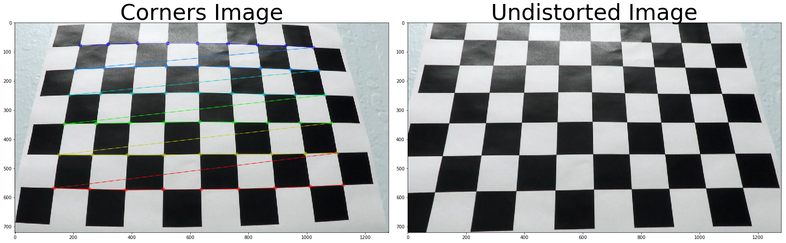
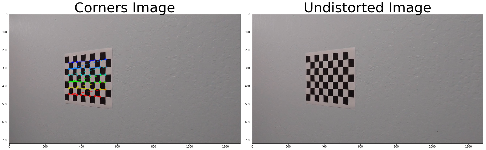
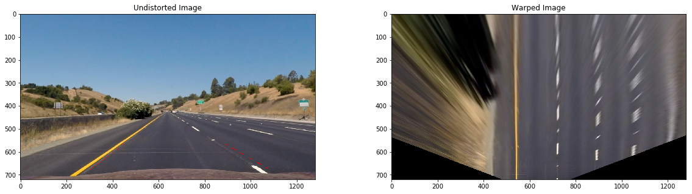
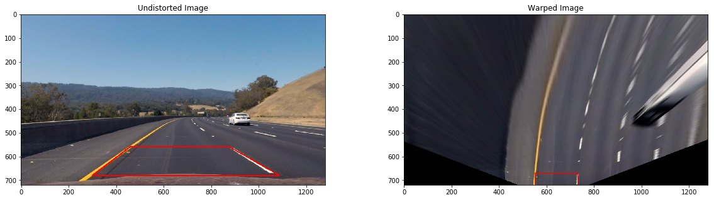
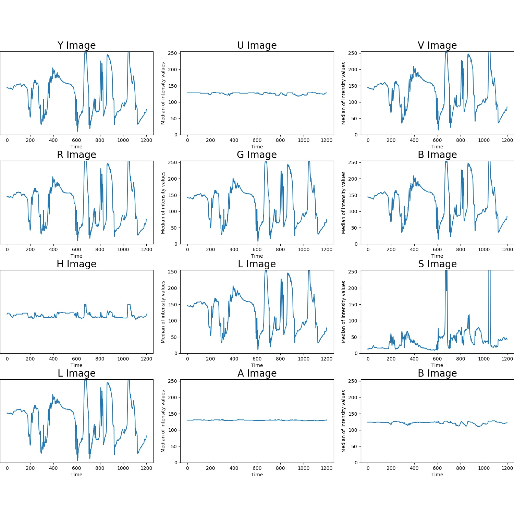
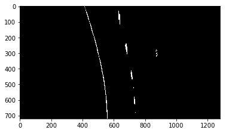

## [Rubric](https://review.udacity.com/#!/rubrics/571/view) Points

### Here I will consider the rubric points individually and describe how I addressed each point in my implementation.  

---

# **Advanced Lane Finding Project**

## Introduction

The goals / steps of this project are the following:

* Compute the camera calibration matrix and distortion coefficients given a set of chessboard images.
* Apply a distortion correction to raw images.
* Use color transforms, gradients, etc., to create a thresholded binary image.
* Apply a perspective transform to rectify binary image ("birds-eye view").
* Detect lane pixels and fit to find the lane boundary.
* Determine the curvature of the lane and vehicle position with respect to center.
* Warp the detected lane boundaries back onto the original image.
* Output visual display of the lane boundaries and numerical estimation of lane curvature and vehicle position.


## Camera Calibration
The raw images captured by a camera may contain distortions introduced by its lens. 
These distortions will introduce error when we try to detect the position of real world objects based on images.
Luckily, the camera distortion is constant and we can correct them. 
The first step in this project is calibrating the camera distortion with OpenCV.

```python
# prepare object points
nx = 9
ny = 6

objpoint = np.zeros((nx*ny, 3), np.float32)
objpoint[:,:2] = np.mgrid[0:nx, 0:ny].T.reshape(-1,2)

# Colloect objpoints and imgpoints from all given chessboard images
objpoints = []
imgpoints = []

for fname in chessboard_image_paths:
    img = cv2.imread(fname)

    # Convert to grayscale
    gray = cv2.cvtColor(img, cv2.COLOR_BGR2GRAY)

    # Find the chessboard corners
    ret, corners = cv2.findChessboardCorners(gray, (nx, ny), None)
       
    if ret is True:
        objpoints.append(objpoint)
        imgpoints.append(corners)

# Undistort image with objpoints and imgpoints
def cal_undistort(img, objpoints, imgpoints):
    """
    A function that takes an image, object points, and image points
    performs the camera calibration, image distortion correction and 
    returns the undistorted image
    """
    ret, mtx, dist, rve, tve = cv2.calibrateCamera(objpoints, imgpoints, img.shape[0:2], None, None)
    undist = cv2.undistort(img, mtx, dist, None, mtx)
    return undist
```

	


OpenCV find the corners of chessboard, then compute the image distortion by assumming that
 all corner points are located on one flat plane. By averaging multiple chessboard images 
 taken by the same camera, OpenCV can compute the camera calibration matrix and use it to 
 calibrate other images from this camera.
The code in the first block of [Report.ipynb](./code/Report.ipynb)

## Lane Finding Pipeline

### 1. Correct image for lens distortion

Apply the camera calibration matrix obtained from previous step on the images to correct the lens distortion.
```python
undistorted = cal_undistort(img, objpoints, imgpoints)
```

Here is an example of using camera calibration matrix to undistort images.


### 2. Apply perspective transform to images (birds-eye view)

To simplified the lane detection, the road surface was projected to the birds-eye view by applying perspective transform.

```python
# Get image size
img_size = undist.shape[0:2][::-1]

# Get source point positions from undistorted image (Red square)
PerspectiveTrans_vertices = get_PerspectiveTrans_vertices(undist)

# Set destination point positions (top_offset from the top, horizontal_offset from left and right)
horizontal_offset = 550
top_offset = 670
src = np.float32(PerspectiveTrans_vertices)
dst = np.float32([[horizontal_offset, top_offset], [img_size[0] - horizontal_offset, top_offset],
				  [img_size[0] - horizontal_offset, img_size[1]], [horizontal_offset, img_size[1]]])

# Compute perspective tranform matrix and warp the image.
M = cv2.getPerspectiveTransform(src, dst)
warped = cv2.warpPerspective(undist, M, img_size)
```




### 3. Apply color threshold to remove road surface and preserve lane markings

In this step, color thresholds were used to split the lane marking pixels from the road background.
To determine the best threshold and color space for spliting the lane markings,
all three videos were converted into different color space.

[](https://www.youtube.com/watch?v=eC2aAvnPy20)
	
| Video                       | Color space           | Video link                                  |
|:---------------------------:|:---------------------:|:-------------------------------------------:|
| project_video.mp4           | sobel_x, sobel_y, RGB, HLS, LAB, YUV    | https://www.youtube.com/watch?v=Wk2xvQiW7zQ |
| challenge_video.mp4         | sobel_x, sobel_y, RGB, HLS, LAB, YUV    | https://www.youtube.com/watch?v=86mGJaZAPVI |
| harder_challenge_video.mp4  | sobel_x, sobel_y, RGB, HLS, LAB, YUV    | https://www.youtube.com/watch?v=KsdNHcoVnGE |

Further more, the median intensity value of each color channel inside RoI (Region of Interest) was plotted. 
In these videos, the RoI area was dominated by the road surface pixels, so the median intensity value of 
each color channel is also the intensity value of the road surface in each color channel. 


By observing the variation of the intensity of road surface in different color channels, we can find out the 
best color space for spliting road surface and lane markings. An ideal color space should have flat road surface 
intensity so that the road surface pixels can be splited robustly.



| Video                       | Color space           | Image link                                  |
|:---------------------------:|:---------------------:|:-------------------------------------------:|
| project_video.mp4           | RGB, HLS, LAB, YUV    | [project_video_RoI_median](./images/project_video.jpg) |
| challenge_video.mp4         | RGB, HLS, LAB, YUV    | [challenge_video_RoI_median](./images/challenge_video.jpg) |
| harder_challenge_video.mp4  | RGB, HLS, LAB, YUV    | [harder_challenge_video_RoI_median](./images/harder_challenge_video.jpg) |

Based on the analysis aboved, LAB space was selected for simplicity reasons. Although the color thresholds are expected to be more robust and accurate 
if combining multiple color channels and stacking multiple thresholds.

After the color threshold step, 	


### 4. Apply sliding windows search to separate left and right lanes


### 5. Fit second order polynomial and measure the curvature radius

### 6. Mark the lane area


#### 2. Describe how (and identify where in your code) you used color transforms, gradients or other methods to create a thresholded binary image.  Provide an example of a binary image result.

I used a combination of color and gradient thresholds to generate a binary image (thresholding steps at lines # through # in `another_file.py`).  Here's an example of my output for this step.  (note: this is not actually from one of the test images)

![alt text][image3]

#### 3. Describe how (and identify where in your code) you performed a perspective transform and provide an example of a transformed image.

The code for my perspective transform includes a function called `warper()`, which appears in lines 1 through 8 in the file `example.py` (output_images/examples/example.py) (or, for example, in the 3rd code cell of the IPython notebook).  The `warper()` function takes as inputs an image (`img`), as well as source (`src`) and destination (`dst`) points.  I chose the hardcode the source and destination points in the following manner:

```python
src = np.float32(
    [[(img_size[0] / 2) - 55, img_size[1] / 2 + 100],
    [((img_size[0] / 6) - 10), img_size[1]],
    [(img_size[0] * 5 / 6) + 60, img_size[1]],
    [(img_size[0] / 2 + 55), img_size[1] / 2 + 100]])
dst = np.float32(
    [[(img_size[0] / 4), 0],
    [(img_size[0] / 4), img_size[1]],
    [(img_size[0] * 3 / 4), img_size[1]],
    [(img_size[0] * 3 / 4), 0]])
```

This resulted in the following source and destination points:

| Source        | Destination   | 
|:-------------:|:-------------:| 
| 585, 460      | 320, 0        | 
| 203, 720      | 320, 720      |
| 1127, 720     | 960, 720      |
| 695, 460      | 960, 0        |

I verified that my perspective transform was working as expected by drawing the `src` and `dst` points onto a test image and its warped counterpart to verify that the lines appear parallel in the warped image.

![alt text][image4]

#### 4. Describe how (and identify where in your code) you identified lane-line pixels and fit their positions with a polynomial?

Then I did some other stuff and fit my lane lines with a 2nd order polynomial kinda like this:

![alt text][image5]

#### 5. Describe how (and identify where in your code) you calculated the radius of curvature of the lane and the position of the vehicle with respect to center.

I did this in lines # through # in my code in `my_other_file.py`

#### 6. Provide an example image of your result plotted back down onto the road such that the lane area is identified clearly.

I implemented this step in lines # through # in my code in `yet_another_file.py` in the function `map_lane()`.  Here is an example of my result on a test image:

![alt text][image6]

---

### Pipeline (video)

#### 1. Provide a link to your final video output.  Your pipeline should perform reasonably well on the entire project video (wobbly lines are ok but no catastrophic failures that would cause the car to drive off the road!).

Here's a [link to my video result](./project_video.mp4)

---

### Discussion

#### 1. Briefly discuss any problems / issues you faced in your implementation of this project.  Where will your pipeline likely fail?  What could you do to make it more robust?

Here I'll talk about the approach I took, what techniques I used, what worked and why, where the pipeline might fail and how I might improve it if I were going to pursue this project further.  
