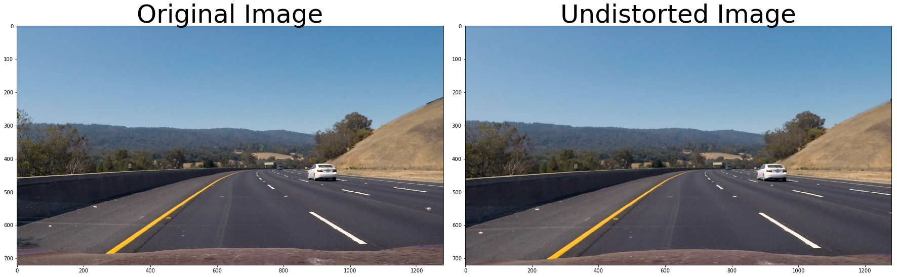
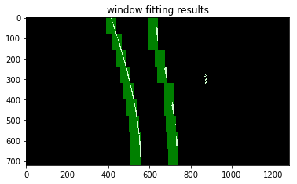

# **Advanced Lane Finding Project**

## Introduction

This prject aims to implement a robust computer-vision-based lane finding pipeline for self driving car. 

The pipeline 
* Compute the camera calibration matrix and distortion coefficients with a set of chessboard images.
* Apply a distortion correction to raw images.
* Use color transforms to create a thresholded binary image.
* Apply a perspective transform to rectify binary image ("birds-eye view").
* Detect lane pixels and fit to find the lane boundary.
* Determine the curvature of the lane and vehicle position with respect to center.
* Warp the detected lane boundaries back onto the original image.
* Output visual display of the lane boundaries and numerical estimation of lane curvature and vehicle position.

## Video

[](https://www.youtube.com/watch?v=l3lIVtXIZcM)

## Camera Calibration
The raw images captured by a camera may contain distortions introduced by its lens. 
These distortions will introduce error when we try to detect the position of real world objects based on images.
Luckily, the camera distortion is constant and we can correct them. 
The first step in this project is calibrating the camera distortion with OpenCV.

```python
# prepare object points
nx = 9
ny = 6

objpoint = np.zeros((nx*ny, 3), np.float32)
objpoint[:,:2] = np.mgrid[0:nx, 0:ny].T.reshape(-1,2)

# Colloect objpoints and imgpoints from all given chessboard images
objpoints = []
imgpoints = []

for fname in chessboard_image_paths:
    img = cv2.imread(fname)

    # Convert to grayscale
    gray = cv2.cvtColor(img, cv2.COLOR_BGR2GRAY)

    # Find the chessboard corners
    ret, corners = cv2.findChessboardCorners(gray, (nx, ny), None)
       
    if ret is True:
        objpoints.append(objpoint)
        imgpoints.append(corners)

# Undistort image with objpoints and imgpoints
def cal_undistort(img, objpoints, imgpoints):
    """
    A function that takes an image, object points, and image points
    performs the camera calibration, image distortion correction and 
    returns the undistorted image
    """
    ret, mtx, dist, rve, tve = cv2.calibrateCamera(objpoints, imgpoints, img.shape[0:2], None, None)
    undist = cv2.undistort(img, mtx, dist, None, mtx)
    return undist
```

	


OpenCV find the corners of chessboard, then compute the image distortion by assumming that
 all corner points are located on one flat plane. By averaging multiple chessboard images 
 taken by the same camera, OpenCV can compute the camera calibration matrix and use it to 
 calibrate other images from this camera.
The code in the first block of [Report.ipynb](./code/Report.ipynb)

## Lane Finding Pipeline (Single image)

### 1. Correct image for lens distortion

Apply the camera calibration matrix obtained from previous step on the images to correct the lens distortion.
```python
undistorted = cal_undistort(img, objpoints, imgpoints)
```

Here is an example of using camera calibration matrix to undistort images.


### 2. Apply perspective transform to images (birds-eye view)

To simplified the lane detection, the road surface was projected to the birds-eye view by applying perspective transform.

```python
# Get image size
img_size = undist.shape[0:2][::-1]

# Get source point positions from undistorted image (Red square)
PerspectiveTrans_vertices = get_PerspectiveTrans_vertices(undist)

# Set destination point positions (top_offset from the top, horizontal_offset from left and right)
horizontal_offset = 550
top_offset = 670
src = np.float32(PerspectiveTrans_vertices)
dst = np.float32([[horizontal_offset, top_offset], [img_size[0] - horizontal_offset, top_offset],
				  [img_size[0] - horizontal_offset, img_size[1]], [horizontal_offset, img_size[1]]])

# Compute perspective tranform matrix and warp the image.
M = cv2.getPerspectiveTransform(src, dst)
warped = cv2.warpPerspective(undist, M, img_size)
```


### 3. Apply color threshold to remove road surface and preserve lane markings

In this step, color thresholds were used to split the lane marking pixels from the road background.
To determine the best threshold and color space for spliting the lane markings,
all three sample videos were converted into different color space.

[](https://www.youtube.com/watch?v=eC2aAvnPy20)
	
| Video                       | Color space           | Video link                                  |
|:---------------------------:|:---------------------:|:-------------------------------------------:|
| project_video.mp4           | sobel_x, sobel_y, RGB, HLS, LAB, YUV    | https://www.youtube.com/watch?v=Wk2xvQiW7zQ |
| challenge_video.mp4         | sobel_x, sobel_y, RGB, HLS, LAB, YUV    | https://www.youtube.com/watch?v=86mGJaZAPVI |
| harder_challenge_video.mp4  | sobel_x, sobel_y, RGB, HLS, LAB, YUV    | https://www.youtube.com/watch?v=KsdNHcoVnGE |

Further more, the median intensity value of each color channel inside RoI (Region of Interest) was plotted. 
In these videos, the RoI area was dominated by the road surface pixels, so the median intensity value of 
each color channel is also the intensity value of the road surface in each color channel. 


By observing the variation of the intensity of road surface in different color channels, we can find out the 
best color space for spliting road surface and lane markings. An ideal color space should have flat road surface 
intensity so that the road surface pixels can be splited robustly.


| Video                       | Color space           | Image link                                  |
|:---------------------------:|:---------------------:|:-------------------------------------------:|
| project_video.mp4           | RGB, HLS, LAB, YUV    | [project_video_RoI_median](./images/project_video.jpg) |
| challenge_video.mp4         | RGB, HLS, LAB, YUV    | [challenge_video_RoI_median](./images/challenge_video.jpg) |
| harder_challenge_video.mp4  | RGB, HLS, LAB, YUV    | [harder_challenge_video_RoI_median](./images/harder_challenge_video.jpg) |

Based on the analysis aboved, LAB space was selected for simplicity reasons. Although the color thresholds are expected to be more robust and accurate 
if combining multiple color channels and stacking multiple thresholds.

```python
def apply_color_threshold(img, color_space_conversion, color_thres):
    C012 = cv2.cvtColor(img, color_space_conversion)

    C0 = C012[:, :, 0]
    C1 = C012[:, :, 1]
    C2 = C012[:, :, 2]

    C0_binary_output = np.zeros_like(C0)
    C1_binary_output = np.zeros_like(C1)
    C2_binary_output = np.zeros_like(C2)

    C0_binary_output[(C0 > color_thres[0][0]) & (C0 < color_thres[0][1])] = 1
    C1_binary_output[(C1 > color_thres[1][0]) & (C1 < color_thres[1][1])] = 1
    C2_binary_output[(C2 > color_thres[2][0]) & (C2 < color_thres[2][1])] = 1

    return C0_binary_output, C1_binary_output, C2_binary_output
	
# Apply color space thresold
LAB_space = cv2.COLOR_RGB2LAB
LAB_thres = [[210, 255], [0, 255], [150, 255]]  # lower and upper bounds for L, A and B channel
L_binary_output, A_binary_output, B_binary_output = apply_color_threshold(undistorted, LAB_space, LAB_thres)
```

After the color threshold step, road surface pixels were removed and lane marking pixels were marked. 
For simplicity reason, only two center lanes were preserved, 
other lanes are removed by applying RoI threshold in the previous step.	


### 4. Apply sliding windows method to separate left and right lanes

```python
window_search_params = {
	'window_width': 50,
	'window_height': 40,  # Break image into 9 vertical layers since image height is 720 #80
	'margin': 100,  # How much to slide left and right for searching
}

window_centroids = find_window_centroids(warped, previous_centers=previous_centers, **window_search_params)
l_points, r_points = apply_window_centroids_mask(warped, window_centroids, **window_search_params)
```



### 5. Fit second order polynomial and measure real-world position

After seperated left and right lane pixels, the lanes can be approximated by fitting second order polynomial.
And the curvature radius of lane can also be calculated by scaling the pixel positions from image coordinates to
real world positions.

```python
def polynomial_fit(points, ploty, xm_per_pix=1, ym_per_pix=1):
	"""
	Args:
		points: pixels of the lane
		ploty: y coordinates for polynomial interpolation
		xm_per_pix: meter per pixel along x-direction
		ym_per_pix: meter per pixel along y-direction
	Returns:
		fit_x: x coordinates of fitting polynomial (fit_x[0]: x_bottom fit_x[-1]: x_top)
		curverad: curvature radius of the lane in real world
	"""
    y_eval = np.max(ploty)
    x = np.argwhere(points == 255)[:, 1]
    y = np.argwhere(points == 255)[:, 0]

    # Fit a second order polynomial to pixel positions in each lane line
    fit = np.polyfit(y, x, 2)
    fit_x = fit[0] * ploty ** 2 + fit[1] * ploty + fit[2]
	
	# Scale x and y coordinates from image coordinates to real world coordinates
	fit_cr = np.polyfit(y*ym_per_pix, x*xm_per_pix, 2)
	# Compute real world curvature
    curverad = ((1 + (2 * fit_cr[0] * y_eval + fit_cr[1]) ** 2) ** 1.5) / np.absolute(2 * fit_cr[0])

    return fit_x, curverad
```


To measure the relative position between lane and car, we need to define the lane center and car center.
In this project, an assummption has been made that the image center is also the car center. 
The lane center is approximated by the center of bottom x coordinates of left and right lane fitting polynomials.
By comparing the lane center and car center in the image, the real world center-shift distance can be obtained.

### 6. Mark the lane area

In the last step, the lane area was filled with green color and apply to a reverse perspective transform so that
the lane area was warped to the original lane shape.
	


Combined the lane area and original image, we obtain the final result.


---

### Pipeline (video)

The single image pipeline is not 

---

### Discussion

#### 1. Briefly discuss any problems / issues you faced in your implementation of this project.  Where will your pipeline likely fail?  What could you do to make it more robust?

Here I'll talk about the approach I took, what techniques I used, what worked and why, where the pipeline might fail and how I might improve it if I were going to pursue this project further.  
